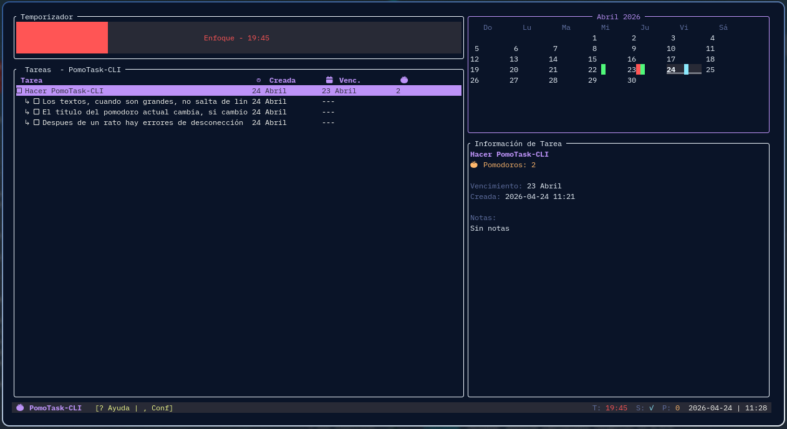
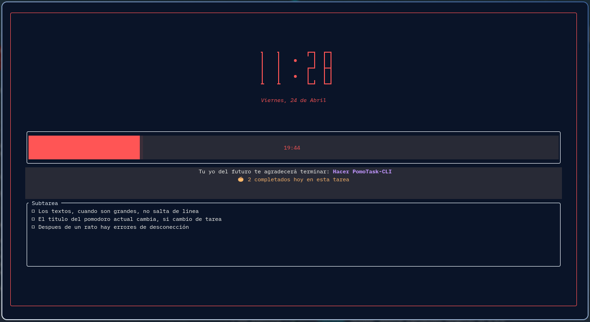

# 🍅 PomoTask-CLI

**PomoTask-CLI** es una interfaz de terminal (TUI) profesional, asíncrona y visualmente atractiva que combina la técnica **Pomodoro** con la gestión de tareas de **Google Tasks**. Diseñada con una estética moderna, modular y altamente personalizable.


## 📸 Capturas de Pantalla

| Vista Principal (Calendario) | Modo Enfoque (Reloj Gigante) |
| :---: | :---: |
|  |  |

## 🧠 ¿Qué es la Técnica Pomodoro?

La **Técnica Pomodoro** es un método de gestión del tiempo desarrollado por Francesco Cirillo a fines de la década de 1980. Se basa en el uso de un temporizador para dividir el trabajo en intervalos (llamados "pomodoros"), tradicionalmente de **25 minutos**, separados por breves descansos.

Este método se fundamenta en la idea de que las pausas frecuentes pueden mejorar la agilidad mental y la concentración. PomoTask-CLI facilita este flujo integrando tus tareas reales de Google directamente en el temporizador.

> [Más información en Wikipedia](https://es.wikipedia.org/wiki/T%C3%A9cnica_Pomodoro)

## ✨ Características Principales

- **☁️ Sincronización Real con Google Tasks**: Gestión bidireccional de tareas y subtareas en tiempo real.
- **📅 Calendario Mensual con Semáforo**: Visualización mensual interactiva con indicadores de color:
    - 🔴 **Rojo**: Tareas pendientes (vencimiento).
    - 🟢 **Verde**: Tareas completadas (historial).
    - 🔵 **Azul**: Tareas creadas o actualizadas.
- **🚀 Navegación Inteligente**: El calendario salta automáticamente al mes de la tarea seleccionada.
- **🌐 Vista Consolidada "Todas"**: Lista virtual que reúne las tareas de todas tus listas reales para una visión global.
- **🎨 Temas visuales**: Soporte nativo para esquemas de colores **Catppuccin**, **Nord**, **Gruvbox** y **Dracula**.
- **🍅 Modo concentración inmersivo**: Pantalla completa con un **reloj digital gigante** y fecha localizada.
- **📑 Gestión de subtareas**: Visualiza y marca subtareas directamente desde el modo enfoque.
- **✨ Animación de Victoria**: Efecto de partículas y tachado visual al completar tareas.
- **⏱️ Pomodoro Inteligente**: Temporizador que se guarda por tarea y se detiene automáticamente al terminar.
- **🔔 Notificaciones**: Avisos nativos de sistema al finalizar sesiones.

## 🛠️ Stack Tecnológico

- **Lenguaje**: Rust 🦀 (Edición 2021) - Código modularizado para alta mantenibilidad.
- **TUI**: [Ratatui](https://ratatui.rs/) + `crossterm`.
- **Async**: `tokio` para operaciones de red no bloqueantes.
- **API**: Integración con Google Cloud via `google-tasks1`.

## 🚀 Instalación y Compilación

### 1. Requisitos Previos
- Tener instalado [Rust y Cargo](https://rustup.rs/).
- Un archivo `client_secret.json` de Google Cloud Console.

### 2. Instalación Rápida (Linux/macOS)
```bash
git clone https://github.com/pl402/pomoTask.git
cd pomoTask
./install.sh
```

El script compilará el proyecto en modo `release` e instalará el binario en `~/.local/bin`.

## ⌨️ Atajos de Teclado (Hotkeys)

| Tecla | Acción |
| :--- | :--- |
| `Espacio` | Iniciar / Pausar Temporizador |
| `Enter` | Completar Tarea / Guardar |
| `j` / `k` | Navegar tareas (el calendario sigue tu selección) |
| `h` / `l` | Cambiar entre listas de tareas (← / →) |
| `[` / `]` | **Navegar Calendario** (mes anterior / siguiente) |
| `Tab` | Abrir selector de listas o saltar campos |
| `,` (Coma) | Configuración (Tiempos, Idioma, Temas) |
| `N` / `A` | Nueva Tarea / Nueva Subtarea |
| `E` | Editar Tarea (disponible en todas las vistas) |
| `C` | Mostrar/Ocultar completadas en la lista |
| `S` | Sincronización manual |
| `?` | Ver Ayuda |
| `Q` / `Esc` | Salir |
| `--version` / `-v` | Ver versión instalada (CLI) |

## 📂 Estructura del Código

El proyecto ha sido refactorizado para ser altamente mantenible:
- `src/ui/`: Componentes modulares de la interfaz (Calendario, Listas, Modales, Temporizador).
- `src/handler.rs`: Lógica centralizada de eventos de teclado.
- `src/app.rs`: Estado de la aplicación y lógica de negocio.
- `src/api.rs`: Comunicación con la API de Google.

---
Desarrollado con ❤️ desde **México** 🇲🇽 por un humano que sobrevive a base de agua, té y papitas con mucho chile. 🍵🔥🌶️
