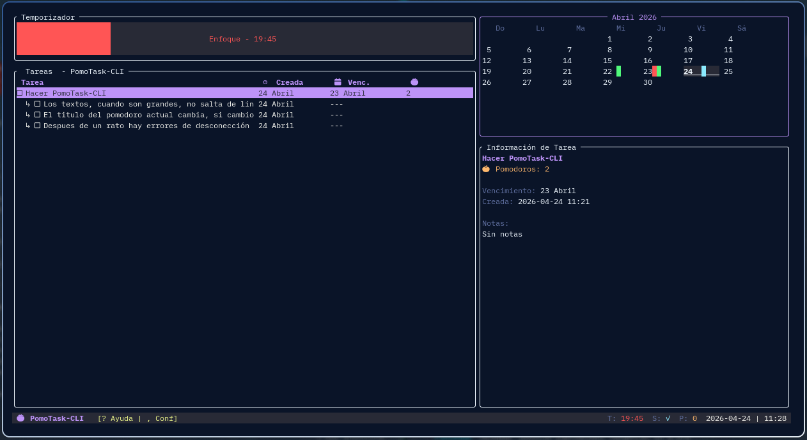
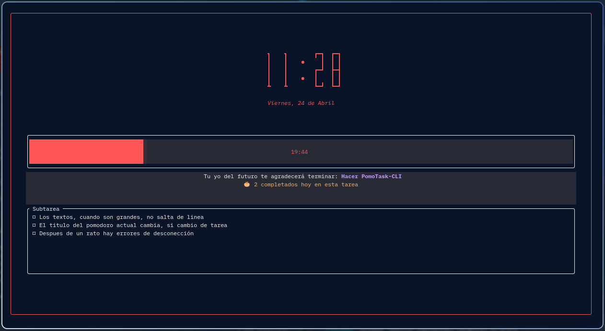

# 🍅 PomoTask-CLI

**PomoTask-CLI** es una interfaz de terminal (TUI) profesional, asíncrona y visualmente atractiva que combina la técnica **Pomodoro** con la gestión de tareas de **Google Tasks**. Diseñada con una estética moderna, modular y altamente personalizable.


## 📸 Capturas de Pantalla

| Vista Principal (Calendario) | Modo Enfoque (Reloj Gigante) |
| :---: | :---: |
|  |  |

## 🧠 ¿Qué es la Técnica Pomodoro?

La **Técnica Pomodoro** es un método de gestión del tiempo desarrollado por Francesco Cirillo a fines de la década de 1980. Se basa en el uso de un temporizador para dividir el trabajo en intervalos (llamados "pomodoros"), tradicionalmente de **25 minutos**, separados por breves descansos.

Este método se fundamenta en la idea de que las pausas frecuentes pueden mejorar la agilidad mental y la concentración. PomoTask-CLI facilita este flujo integrando tus tareas reales de Google directamente en el temporizador.

> [Más información en Wikipedia](https://es.wikipedia.org/wiki/T%C3%A9cnica_Pomodoro)

## ✨ Características Principales

- **☁️ Sincronización Real con Google Tasks**: Gestión bidireccional de tareas y subtareas. Sincroniza todas las listas en segundo plano al iniciar y cada N minutos (configurable; cambiar de lista no re-consulta, usa caché local).
- **🔗 Conexión Automática**: Servidor local temporal para capturar credenciales OAuth sin copiar/pegar códigos.
- **📅 Vistas de Calendario Personalizables**:
    - **Semáforo**: Indicadores clásicos de Pendiente (🔴), Hecho (🟢) y Actividad (🔵).
    - **Mapa de Calor**: Intensidad de color basada en tareas completadas por día (estilo GitHub).
    - **Progreso Diario**: Visualización de porcentaje de cumplimiento mediante iconos dinámicos.
- **⏱️ Análisis Horario**: Vistas por **Mes**, **Semana** (cuadrícula horaria) y **Día** (detalle por hora) con soporte de zona horaria local.
- **📊 Panel de Estadísticas** (`T`): Gráficas de barras de pomodoros y tareas completadas por día (últimos 7 días) más totales históricos.
- **🔍 Búsqueda Instantánea** (`/`): Filtrado de tareas por texto en tiempo real mientras escribes.
- **📴 Modo Offline**: Las tareas se cachean localmente; si no hay conexión al arrancar, se muestran las últimas sincronizadas en lugar de una pantalla vacía.
- **🔀 Mover entre Listas** (`M`): Reubica una tarea (con sus subtareas) en otra lista de forma segura (recrea en destino y luego borra el origen).
- **📋 Copiar al Portapapeles** (`y`): Copia la tarea seleccionada como texto markdown, incluyendo su descripción, fecha y todas sus subtareas con sus notas.
- **🧹 Limpieza Automática de Estadísticas**: Al iniciar, poda los registros horarios locales más antiguos que el periodo configurado (último mes / año / siempre). Es **solo local: nunca borra nada de Google Tasks**. Configurable en Ajustes (`,`).
- **🎨 Personalización Estética Avanzada**:
    - **Temas Expandidos**: Soporte nativo para Catppuccin, Nord, Gruvbox, Dracula, Monokai, Solarized Dark, Ocean, Tokyo Night y Rosé Pine.
    - **Temas Custom**: Posibilidad de definir paletas RGB propias en `config.json`.
- **🚀 Interfaz Ultrarrápida (Optimistic UI)**:
    - **Feedback Inmediato**: Inserción instantánea de tareas y spinners animados mientras se sincroniza con la nube.
    - **Animación de Victoria**: Efecto de partículas y tachado visual tras confirmación de la API.
- **🌐 Multilingüe**: Soporte completo para Español e Inglés con mensajes motivacionales dinámicos en listas vacías.
- **🍅 Modo Concentración Inmersivo**: Pantalla completa con reloj digital gigante y gestión de subtareas.
- **⏳ Ciclo Pomodoro Completo**: Descanso corto tras cada enfoque y **descanso largo automático cada 4 pomodoros** (o cambio manual de modo con `m`).
- **🔔 Notificaciones**: Avisos nativos del sistema al finalizar sesiones.
- **🧩 Integración Nativa con Omarchy Quattro**: Plugin oficial (`io.github.pl402.pomotask`) con widget para la barra de estado y panel flotante para gestionar Pomodoro y tareas sin abrir la terminal.
- **🛡️ Monitor Anti-distracciones (Hyprland)**: Detección activa de ventanas y páginas bloqueadas (Facebook, YouTube, Reddit, Discord, etc.) durante las sesiones de trabajo con alertas OSD y desenfoque preventivo.
- **🔒 Bloqueo Estricto en Descansos**: Opción para bloquear la pantalla automáticamente (`omarchy system lock`) o mostrar overlay de descanso activo para asegurar pausas reales.
- **⚡ Interfaz IPC / Subcomandos CLI**: Control headless (`pomotask-cli ipc ...`) con salida JSON para integraciones externas, scripts y barras de estado.

## 🛠️ Stack Tecnológico y Arquitectura

- **Rust 🦀 (Edición 2021)**: Código optimizado para alto rendimiento y seguridad de memoria.
- **Arquitectura Modular**:
    - `src/ui/palette.rs`: Lógica de temas y colores totalmente desacoplada.
    - `src/app/i18n.rs`: Sistema de internacionalización centralizado.
    - `src/api.rs`: Comunicación asíncrona robusta con Google Cloud.
- **Ratatui + Tokio**: Interfaz de terminal reactiva con procesamiento de red no bloqueante.

## 🚀 Instalación y Compilación

### 1. Configuración de la API de Google (client_secret.json)
Para que PomoTask-CLI pueda sincronizarse con tus tareas, necesitas tus propias credenciales de Google Cloud:

1. Ve a [Google Cloud Console](https://console.cloud.google.com/).
2. Crea un nuevo proyecto (ej. "PomoTask").
3. En el buscador superior, busca **"Google Tasks API"** y haz clic en **Habilitar**.
4. Ve a **"Pantalla de consentimiento de OAuth"**:
    - Selecciona tipo de usuario **Externo**.
    - Rellena los datos obligatorios (nombre de app, email).
    - En **Permisos (Scopes)**, añade: `https://www.googleapis.com/auth/tasks`.
    - En **Usuarios de prueba**, añade tu propio correo electrónico de Google.
5. Ve a **"Credenciales"**:
    - Haz clic en **Crear credenciales** -> **ID de cliente de OAuth**.
    - Tipo de aplicación: **App de escritorio**.
    - Nombre: PomoTask-CLI.
6. Una vez creado, descarga el archivo JSON.
7. Renombra el archivo descargado a `client_secret.json` y colócalo en la raíz del proyecto `pomoTask/`.

### 2. Requisitos Previos
- Tener instalado [Rust y Cargo](https://rustup.rs/).
- El archivo `client_secret.json` configurado en el paso anterior.

### 3. Instalación Rápida (Linux/macOS)
```bash
git clone https://github.com/pl402/pomoTask.git
cd pomoTask
./install.sh
```

El script compilará el proyecto en modo `release` e instalará el binario en `~/.local/bin`.

### 4. Instalación del Plugin para Omarchy Quattro (Opcional)

Si utilizas el entorno de escritorio **Omarchy**, puedes instalar el plugin oficial para la barra de estado y el panel interactivo:

```bash
./install-plugin.sh
```

Esto compilará `pomotask-cli`, lo instalará en `~/.local/bin`, copiará los componentes QML a `~/.config/omarchy/plugins/io.github.pl402.pomotask/` y registrará el plugin en Omarchy Shell.

Para activar el widget en tu barra de Omarchy:
```bash
omarchy plugin enable io.github.pl402.pomotask --section center
# O para moverlo si ya está activo:
omarchy bar move io.github.pl402.pomotask --section center
```

## 🧩 Plugin para Omarchy Quattro

El plugin de PomoTask para **Omarchy Quattro** (`io.github.pl402.pomotask`) proporciona una experiencia visual e integrada en el escritorio:

- **BarWidget (`BarWidget.qml`)**: Muestra en la barra el estado del Pomodoro (🍅 / ☕ / 🌴), tiempo restante y la tarea en foco. Clic izquierdo para desplegar el panel; clic central o scroll para iniciar/pausar.
- **Panel Interactivo (`Panel.qml`)**:
  - Reloj de cuenta regresiva con barra de progreso y selector de ciclo.
  - Gestión completa de Google Tasks con selector de lista, creación rápida de tareas y foco en tareas individuales (🎯).
  - Toggles para modo anti-distracciones y bloqueo estricto de descansos.
  - Botón de acceso directo para abrir la TUI completa en terminal.
- **Monitor Anti-distracciones (`DistractionMonitor.qml`)**: Monitorea eventos de Hyprland en tiempo real; si se abre una ventana o pestaña bloqueada durante el enfoque, emite advertencias OSD y desenfoca la distracción.
- **Overlay de Descanso (`BreakOverlay.qml`)**: Pantalla de pausa activa y estiramientos durante los descansos o bloqueo de pantalla si el modo estricto está habilitado.

### Configuración del Monitor Anti-distracciones

Las reglas de bloqueo se configuran en `~/.config/pomotask/blocklist.json`:
```json
{
  "title_keywords": ["facebook", "twitter", "x.com", "instagram", "reddit", "youtube.com", "tiktok", "netflix", "twitch.tv"],
  "blocked_classes": ["steam", "discord", "spotify"],
  "action": "warn_and_unfocus"
}
```
Acciones disponibles: `"warn"`, `"warn_and_unfocus"`, `"minimize"`.

## 💻 Interfaz IPC y Subcomandos CLI

PomoTask-CLI incluye subcomandos headless pensados para scripts, automatización e integración con barras de estado o extensiones:

| Subcomando | Descripción |
| :--- | :--- |
| `pomotask-cli ipc status` | Obtiene el estado actual del temporizador y tarea activa en JSON |
| `pomotask-cli ipc timer <start\|pause\|toggle\|skip\|reset>` | Controla el temporizador de Pomodoro |
| `pomotask-cli ipc tasks list [--list-id <id>]` | Lista las tareas en formato JSON estructurado |
| `pomotask-cli ipc task complete <task_id>` | Marca una tarea como completada (optimistic + sync) |
| `pomotask-cli ipc task create --title "<t>" [--list-id <id>] [--parent <id>]` | Crea una nueva tarea o subtarea |
| `pomotask-cli ipc task focus <task_id\|clear>` | Asigna o remueve la tarea activa del temporizador |
| `pomotask-cli ipc sync` | Fuerza la sincronización de listas con Google Tasks |
| `pomotask-cli ipc blocklist get` | Consulta la configuración actual del bloqueador |
| `pomotask-cli ipc blocklist add [--keyword <k>] [--class <c>]` | Añade palabras clave o clases bloqueadas |
| `pomotask-cli ipc blocklist remove [--keyword <k>] [--class <c>]` | Remueve reglas del bloqueador |

## ⌨️ Atajos de Teclado (Hotkeys)

| Tecla | Acción |
| :--- | :--- |
| `Espacio` | Iniciar / Pausar Temporizador |
| `m` | Cambiar modo del temporizador (Enfoque → Descanso corto → Descanso largo) |
| `Enter` | Completar Tarea / Guardar |
| `j` / `k` | Navegar tareas (el calendario sigue tu selección) |
| `h` / `l` | Cambiar entre listas de tareas (← / →) |
| `[` / `]` | **Navegar Calendario** (mes anterior / siguiente) |
| `Tab` | Abrir selector de listas o saltar campos |
| `,` (Coma) | Configuración (Tiempos, Idioma, Temas, Vistas, Retención de datos, Intervalo de sync) |
| `N` / `A` | Nueva Tarea / Nueva Subtarea |
| `E` | Editar Tarea (disponible en todas las vistas) |
| `y` | Copiar Tarea al portapapeles (con notas y subtareas) |
| `M` | Mover Tarea (y sus subtareas) a otra lista |
| `C` | Mostrar/Ocultar completadas en la lista |
| `S` | Sincronización manual |
| `/` | Buscar / filtrar tareas por texto (Enter: aplicar · Esc: limpiar) |
| `T` | Ver Estadísticas (gráficas de los últimos 7 días) |
| `?` | Ver Ayuda |
| `Q` / `Esc` | Salir |
| `--version` / `-v` | Ver versión instalada (CLI) |

## 📂 Estructura del Código

Arquitectura diseñada para ser modular, legible y fácil de extender:
- `src/ui/`: Componentes de interfaz (Calendario, Listas, Modales, Temporizador, Estadísticas).
- `src/ui/palette.rs`: Sistema dinámico de temas y colores.
- `src/ui/stats.rs`: Pantalla de estadísticas (gráficas de barras).
- `src/app/`: Lógica de negocio, estado global y **caché por lista** (cambio de lista sin esperar a la red).
- `src/app/i18n.rs`: Motor de internacionalización (Español/Inglés).
- `src/handler.rs`: Lógica centralizada de teclado + sincronización (`sync_tasks` / `sync_all_lists`).
- `src/api.rs`: Integración asíncrona con Google Tasks API.
- `src/ipc.rs`: Controlador de comandos IPC (`status`, `timer`, `task`, `blocklist`, `sync`) y persistencia de runtime.
- `plugins/io.github.pl402.pomotask/`: Plugin nativo QML para Omarchy Quattro (BarWidget, Panel, DistractionMonitor, BreakOverlay).

> **Desarrollo**: `cargo run` (TUI), `cargo test` (tests unitarios de lógica pura), `cargo clippy`
> (0 warnings), `cargo fmt`. Requiere `client_secret.json` en la raíz para compilar (o se usa un
> placeholder y la app corre en modo simulado). Comentarios y UI en español; commits en Conventional Commits.

---
Desarrollado con ❤️ desde **México** 🇲🇽 por un humano que sobrevive a base de agua, té y papitas con mucho chile. 🍵🔥🌶️
